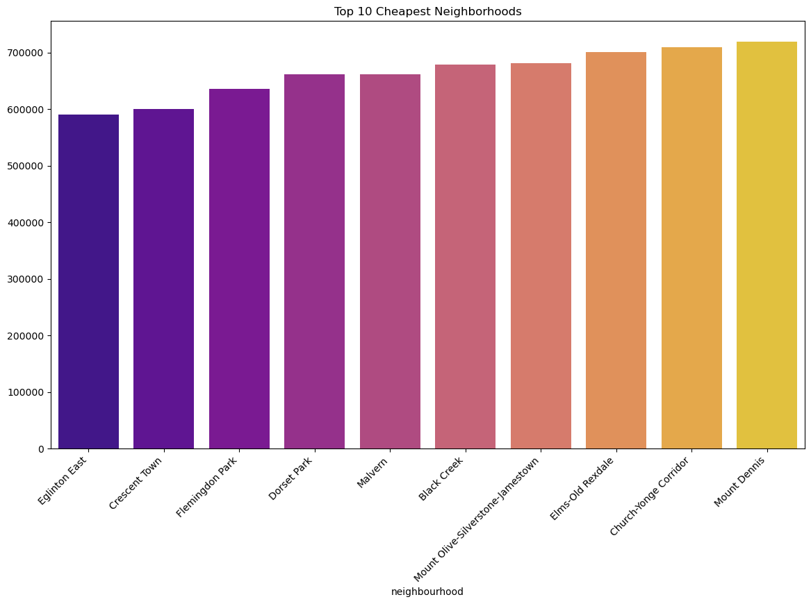

# Exploratory Data Analysis (EDA) Report

## Overview

The dataset consists of real estate listings in Toronto obtained from Listing.ca. The goal of this exploratory data analysis (EDA) is to gain insights into the key features and characteristics of the data.

## Key Findings

### 1. Property Types

- Condo apartments are the most common property type in the dataset, followed by detached homes, freehold townhomes, and condo townhomes.

### 2. Price Distribution

- The distribution of property prices varies widely, with most listings falling within the mid to high range. There are likely some outliers with extremely high prices that may need further investigation.

### 3. Bedrooms and Bathrooms

- The number of bedrooms and bathrooms in the listings shows a diverse range. Most properties have 1-2 bedrooms and bathrooms, but there are also listings with more.

### 4. Most expensive and Cheapest Neighbourhoods

- The latitude and longitude information has been successfully obtained for a majority of the listings using the Geoapify API. Visualizations below. 

### 5. Failed API Calls

- A notable number of API calls failed during the geocoding process, particularly for addresses with specific suffixes or unconventional formatting. Further cleaning or alternative geocoding methods may be required.

### 6. Data Cleaning and Preprocessing

- Listings with 0 baths and more than 5 baths were removed.
- Outliers were removed based on the Interquartile Range (IQR) for each property type.
- Latitude and longitude information is available for all listings, after cleaning.

## Modeling and Insights

- A Random Forest Regressor model was trained to predict property prices based on features such as baths, beds, dens, relative latitude, and relative longitude.
- Cross-validation was employed to evaluate the model's performance, providing Mean Absolute Error (MAE) scores for each fold.
- The model was applied to the test set, yielding a Test MAE of 76,558.39.
- Neighbourhood-wise analysis revealed varying ratios of prediction errors, with New Toronto having the highest margin of error (13.49%). This was attributed to a small number of listings in that neighbourhood, impacting data robustness.

## Visualizations

### Property Type Distribution

### Price Distribution

### Most expensive and Cheapest Neighbourhoods

### Prediction Error Ratios by Neighbourhood

